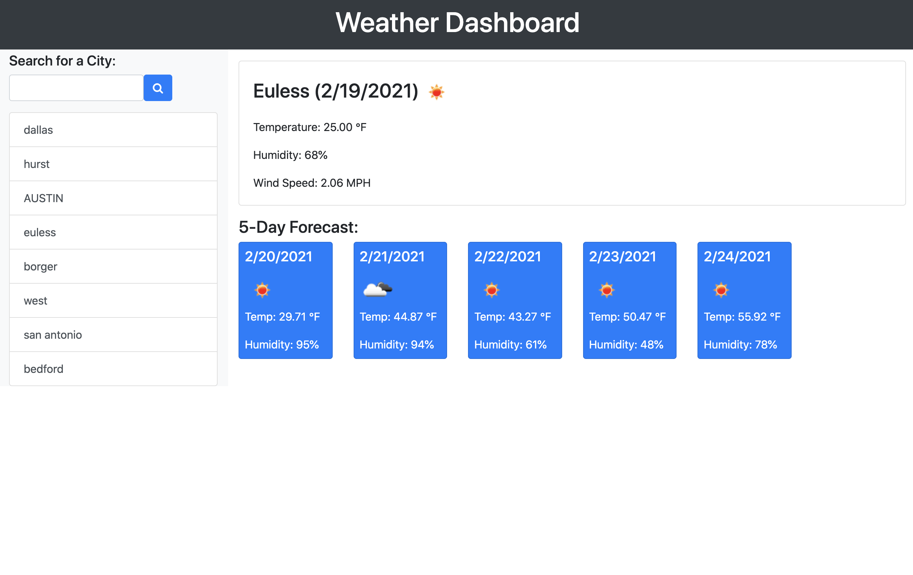

  # Weather API Dashboard

  ## Description
  A weather dashboard that will run in the browser and feature dynamically updated HTML and CSS via a Third Party API.

 ## User Story

```
AS A traveler
I WANT to see the weather outlook for multiple cities
SO THAT I can plan a trip accordingly
```

## Acceptance Criteria

```
GIVEN a weather dashboard with form inputs
WHEN I search for a city
THEN I am presented with current and future conditions for that city and that city is added to the search history
WHEN I view current weather conditions for that city
THEN I am presented with the city name, the date, an icon representation of weather conditions, the temperature, the humidity, the wind speed, and the UV index
WHEN I view the UV index
THEN I am presented with a color that indicates whether the conditions are favorable, moderate, or severe
WHEN I view future weather conditions for that city
THEN I am presented with a 5-day forecast that displays the date, an icon representation of weather conditions, the temperature, and the humidity
WHEN I click on a city in the search history
THEN I am again presented with current and future conditions for that city
WHEN I open the weather dashboard
THEN I am presented with the last searched city forecast
```
  

  ## Table of Contents
  * [Screenshot](#screenshot)
  * [Technologies](#technologies)
  * [Project URLs](#urls)
  * [Author](#author)


  ## Screenshot
  


  ## Technologies
  * HTML
  * CSS
  * Bootstrap
  * JQuery
  * Javascript
  * AJAX
  * Third Party API (OpenWeather API)


  ## URLs
  * Deployed App:
  https://evadllewop.github.io/WeatherDashboard/

  * Github Repo:
  https://github.com/evadllewop/WeatherDashboard
 

  ## Author

  Dave Powell

  

  * [Github Profile](https://github.com/evadllewop)


